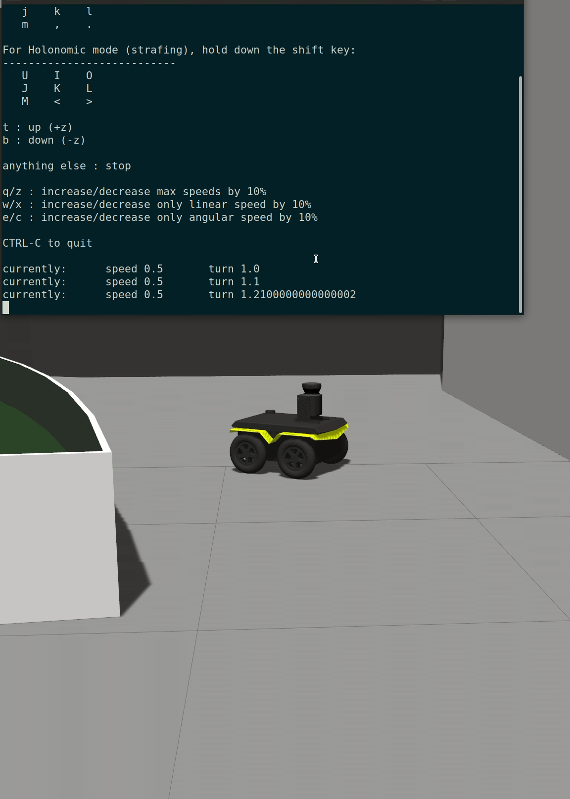

# Unicampus Gazebo Simulation with Jackal Robot
## Overview
Welcome to the Unicampus Gazebo Simulation repository! This comprehensive guide is designed to
help you set up and run a realistic simulation of the Jackal robot in a custom Gazebo world,
specifically tailored for educational and research purposes.
## Custom Gazebo World and Models
In this section, you will find detailed instructions on accessing and utilizing the custom models and
ROS packages developed for the Unicampus Gazebo simulation.

 

### PREREQUISITES
To ensure a smooth setup, please have the following prerequisites installed:

**- ROS (Robot Operating System):**
ROS is an open-source framework for building and controlling robots. It offers tools, libraries, and conventions to develop robotic software. The versions (Kinetic, Melodic, or Noetic) represent different releases, each with unique features and compatibility.

**- Gazebo (3D Simulation Environment):**
Gazebo is a robust simulation tool providing a lifelike 3D environment for testing robots and systems. It enables developers to validate algorithms in a simulated world before deploying them on a physical robot. Often used with ROS, Gazebo facilitates comprehensive robot simulations.

**- Jackal Simulation Packages:**
These packages are tailored for simulating the Jackal robot in ROS. They include models replicating Jackal's dynamics and sensors. Developers use these packages to simulate Jackal's movement, interactions, and sensor readings in Gazebo's virtual environment.

### INSTALLATION GUIDE
Follow these steps to set up your simulation environment:
1. **Repository Cloning**:
 Clone the repository to your local machine:
 ```bash

 git clone git@github.com:wlaa41/clearpath_university-campus.git
 ```
2. **Building the Workspace**:
Navigate to your ROS workspace with `cd` and organize your robot tools (ROS packages) using `catkin_make`. It's like setting up a toolbox back in home – by doing this, you ensure everything works smoothly and in order when you run simulations or control your robot. 
 ```bash
 mkdir ~/Document/clearpath1
 cd ~/Documents/clearpath1
 catkin_make
 ```
3. **Environment Setup**:
Imagine you're getting ready to work on a project, and you need to set up your work area. This command is like turning on the lights and making sure everything is in the right place. It helps your computer know where to find the tools (ROS packages) you just organized, so when you run your robot simulation or do any work, everything runs smoothly.
 ```bash
 source devel/setup.bash
 ```
Also, in the repository, there's a file named `launch`. Follow these steps to set up the ROS package:

Open a terminal and navigate to your ROS workspace.Run the following command to create a ROS package named "unicampus" with necessary dependencies:
```bash
catkin_create_pkg unicampus rospy roscpp
```
Ensure the existence of the `launch`  directory within the `unicampus` package. If not, create it and place the launch file inside. This file holds configurations for launching nodes in the Unicampus Gazebo Simulation, completing the ROS package setup for simulation control.

In ROS, think of a **node** like a small worker bee. Each bee (node) has a specific job, like sensing or moving, and they talk to each other to get things done for the robot hive (your robot project).

### ADDING CUSTOM MODELS TO GAZEBO
Integrate custom models into your Gazebo simulations by following these steps:

 

1. **Model Transfer**:
 Copy the `models` folder from the repository to your Gazebo model directory:
 ```bash
 cp -r models/* ~/.gazebo/models/
 ```
2. **Verification**:
 Ensure the models are correctly copied by checking the Gazebo model directory:
 ```bash
 ls ~/.gazebo/models/
 ```
 The output should list the custom model names.
 
### LAUNCHING THE SIMULATION
Start the simulation by executing these commands:
1. **Gazebo World Launch**:
 Initiates the Unicampus Gazebo world along with the Jackal robot equipped with a Fornt Laser:
 ```bash
 export JACKAL_LASER=1
 roslaunch unicampus unicampus.launch
 ```
 

2. **RViz Visualization**:
 To visualize the robot and its sensor data in RViz:
 ```bash
 roslaunch jackal_viz view_robot.launch
 ```

### OPTIONAL: INSTALLING TELEOP_TWIST KEYBOARD:
For enhanced control of your robot in the simulation, you may opt to install the
`teleop_twist_keyboard` package. This package allows you to control the robot's movement using
your keyboard's arrow keys.
#### Update Your Package List
First, make sure you have the latest information about available packages:
```bash
sudo apt-get update
```
#### Install the teleop_twist_keyboard Package
Depending on your version of ROS, use one of the following commands:
- For ROS Melodic or Noetic:

 ```bash
 sudo apt-get install ros-noetic-teleop-twist-keyboard
 ```
##### Using the teleop_twist_keyboard Package
Once the installation is complete, you can launch the keyboard teleoperation interface:
```bash
rosrun teleop_twist_keyboard teleop_twist_keyboard.py
```
 

Make sure you have the ROS environment properly sourced in your terminal before running the
`rosrun` command.
## COMPREHENSIVE GUIDE TO MAP GENERATION AND SAVING IN CUSTOM UNICAMPUS WORLD WITH JACKAL ROBOT
### Overview
This document provides an in-depth guide to generating and saving maps in a custom Unicampus Gazebo Simulation using the Jackal robot. It is specifically tailored for the ROS package `unicampus` and the launch file `unicampus.launch`.
### Understanding ROS Command Syntax
ROS (Robot Operating System) provides a flexible framework for writing robot software. It consists of a collection of tools and libraries designed to simplify the task of creating complex and robust robot behavior across a wide variety of robotic platforms.
### Key ROS Commands:
- `roslaunch`: This command is used to start ROS nodes from a launch file. It can launch multiple nodes and set parameters in the ROS parameter server.
- `rosrun`: This command runs a single ROS node from a ROS package.
### Step-by-Step Guide for Map Generation and Saving
#### 1. Start Your Custom Unicampus Gazebo Simulation
- **Command:** 
 ```
 roslaunch unicampus unicampus.launch
 ```
- **Purpose:** Initializes the Gazebo simulation with the Jackal robot within the custom Unicampus environment.
#### 2. Launch the Gmapping for SLAM (Simultaneous Localization and Mapping) 
- **Command:** 
 ```
 roslaunch jackal_navigation gmapping_demo.launch
 ```
- **Purpose:** Gmapping provides SLAM capabilities, crucial for autonomous mapping. It processes the robot's laser scans and odometry to construct a 2D map of the environment.SLAM (Simultaneous Localization and Mapping) in gmapping is a technique where a robot builds a map of its environment while simultaneously determining its own position within that map, allowing it to navigate in unknown spaces.
#### 3. Visualize in RViz
- **Command:** 
 ```
 roslaunch jackal_viz view_robot.launch config:=gmapping
 ```
- **Purpose:** Configures RViz to visualize the mapping process, showing data from the robot's sensors and the developing map in real-time.
#### 4. Navigate and Map the Environment
- **Activity:** Control the robot manually or with an automated system to explore the Unicampus environment. The data collected is used by Gmapping to build the map.

 

#### 5. Save the Generated Map
- **Command:** 
 ```
 rosrun map_server map_saver -f mymap
 ```
- **Purpose:** Saves the created map in two files: `mymap.pgm` (image file) and `mymap.yaml` (metadata file).
### Alternative Mapping Solution: Using Cartographer for SLAM
Cartographer is another SLAM solution that can be used for map generation in ROS. It is known for its ability to generate high-quality 2D and 3D maps even in complex environments.
#### Steps for Cartographer SLAM:
1. **Install Cartographer ROS:** Follow the installation instructions provided in the Cartographer ROS documentation.
2. **Configuration:** Configure Cartographer to work with your specific robot sensors and Unicampus environment.
3. **Launch Cartographer:** Use a command similar to the following, adjusted for your setup:
 ```
 roslaunch [cartographer_package] [cartographer_launch_file].launch
 ```
4. **Mapping and Navigation:** As with Gmapping, navigate your robot around the environment.
5. **Saving the Map:** Use the Cartographer tools to save the generated map.
### Additional Considerations
- **Robot Setup:** Ensure that your robot is properly equipped with the necessary sensors for accurate mapping.
- **Environment Complexity:** The complexity of your Unicampus environment can affect the mapping process. More complex environments may require more thorough navigation to achieve a complete map.
- **Sensor Calibration:** Proper calibration of sensors is crucial for accurate map generation. This includes calibrating laser scanners, odometry, and any other sensors used by the robot.
### Important Notes
- Follow the command sequences accurately.
- Customize file paths and names as needed for your specific ROS environment.
- Separate terminal windows are recommended for monitoring each process effectively.
- Map quality is highly dependent on the coverage of the robot's exploration and sensor accuracy.
### Conclusion
Mapping in a robotic simulation environment is a crucial step in the development of autonomous navigation systems. By following the steps outlined in this guide, users can effectively generate and save maps of their custom Unicampus environments, utilizing either Gmapping or Cartographer for SLAM."

### Deliberative Navigation with AMCL Demo
For AMCL-based navigation (requires a pre-existing map):
```bash
roslaunch jackal_navigation amcl_demo.launch [map_file map.yaml]
```
Visualize the AMCL localization in RViz:
```bash
rviz roslaunch jackal_viz view_robot.launch config:=localization
```
 

Each of these commands launches different aspects of the robot's navigation capabilities, allowing
for experimentation and learning in various scenarios. Ensure that you have the necessary
packages and configurations set up as per the earlier sections of this guide.


# Navigating the Unknown: Mastering AMCL in ROS

## Embarking on the Robotic Odyssey
Embark on a journey into the realm of robotics where understanding your environment is the key to not just surviving, but thriving. Adaptive Monte Carlo Localization (AMCL) is your trusty map and compass in the vast seas of autonomous navigation.

### The Heart of Navigation: AMCL
Adaptive Monte Carlo Localization (AMCL) is a powerful particle filter-based localization system designed for robots to find themselves in a predefined world. It's like giving your robot a sense of 'self' within the digital landscapes it traverses.

### Prerequisites: The Cartographer's Tools
Before setting sail, ensure you have the following:
- A digital map (`map.yaml` and `map.pgm`)—your world from a bird's eye view.
- The `amcl` ROS package—the brain behind the localization.

### Commanding the Helm: Launching AMCL
```bash
roslaunch jackal_navigation amcl_demo.launch map_file:=/path/to/your/map.yaml
```
This incantation conjures up the AMCL wizardry. Your robot awakens to the world around it, using lasers to feel out the space and odometry as its internal compass.

### The Seer's Vision: Visualizing with RViz
```bash
roslaunch jackal_viz view_robot.launch config:=localization
```
With RViz, gaze into the crystal ball where you see your robot's thoughts—the map, its path, and how it perceives its surroundings.

## The Alchemy of Parameters: AMCL's Inner Workings
Tune the potions and spells—AMCL parameters—to refine your robot's senses.
- `~use_map_topic`: Decides if the robot should listen for map updates.
- `~odom_frame_id`: The name tag for your robot's odometry frame.
- `~base_frame_id`: The name tag for your robot's chassis.
- `~global_frame_id`: The grand stage, usually dubbed 'the map'.

## Sharpening Your Robot's Intuition: Tuning AMCL
Your robot's intuition is only as sharp as its calibration. Like a finely tuned instrument, adjust the odometry and sensor models to resonate with the environment.

## Conclusion: The Enlightened Machine
Armed with AMCL and RViz, your robot is no longer a mere wanderer but an enlightened traveler with a purpose and a destination.

Remember, the art of robotics is a path of continuous learning. Each challenge is a lesson, and every failure is a stepping stone to success.

### Repository Structure
- `src`: Contains ROS packages crucial for simulation.
- `models`: Custom Gazebo models designed for the Unicampus world.
### Contributing to the Project
Your contributions to this project are highly appreciated. To contribute:
1. Fork the repository.
2. Make your changes or enhancements.
3. Submit a pull request for review.
### License
This project is licensed under the MIT License. For more details, contact the owner of the repo wlaa41


<br>


<br>
<br>
<br>
<br>
<br>
<br>
<br>
<br>
<br>
<br>
<p align="center">

  


</p>
<br>
<br>
<br>
<br>
<br>
<br>
<br>
<br>
<br>
<br>
<!---

<br>
<br>


<p align="center">
  <span style="font-size: 30px; font-weight: bold;"> ### From π to φ, in the algorithmic sky</span><br>
  <span style="font-size: 44px; font-weight: bold;"> # Our robot does fly</span>
</p>

--->


